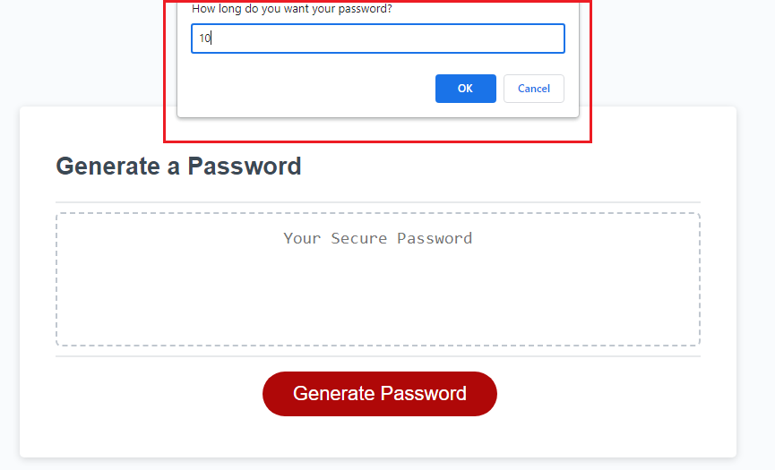

# Password-Generator

## Description

This project is a password generator. 

I built this project because I wanted to create a tool that would help people generate strong passwords. Strong passwords are important because they can help protect your accounts from being hacked.
This project solves the difficulty of creating strong passwords. Strong passwords are difficult to come up with on the spot, and they can be difficult to type. This project makes it easy to create strong passwords that are ready to be copied and pasted. This is my first project that had practical use. I learned about functions, variables, loops, and conditional statements and how the all function together to get a working product. 

## Installation

Launch the website at 

## Usage
To use the password generator you want to start by pressing the "Generate Password" button. 

You will then be prompted with questions about the characters you want in your password and your password length. Please be sure to only write a number when asked about the length of the password. 

After answering all the prompts you password should be generated and ready for you to copy within this text box. 

